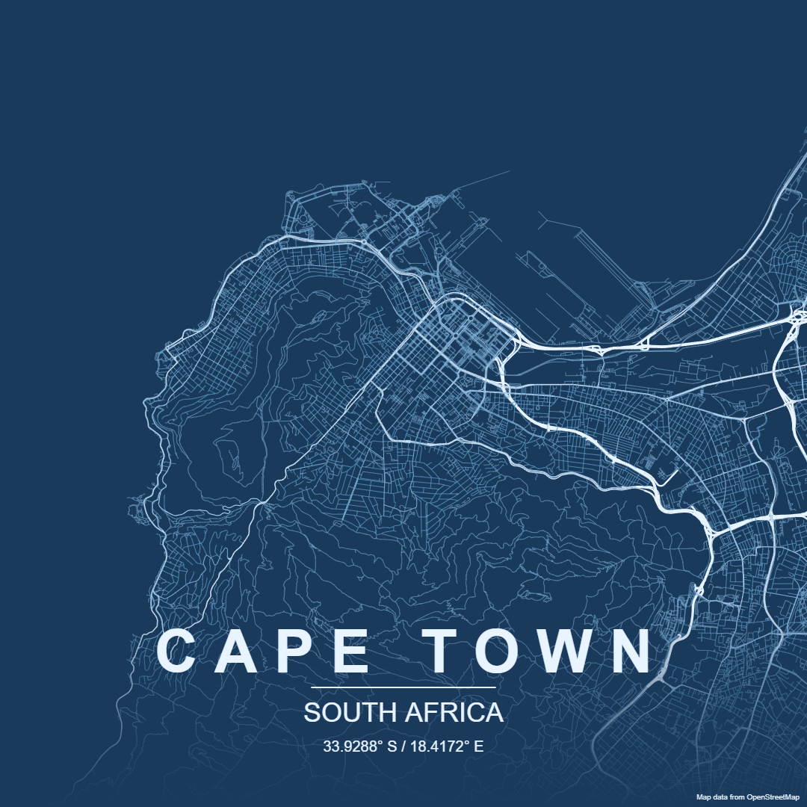
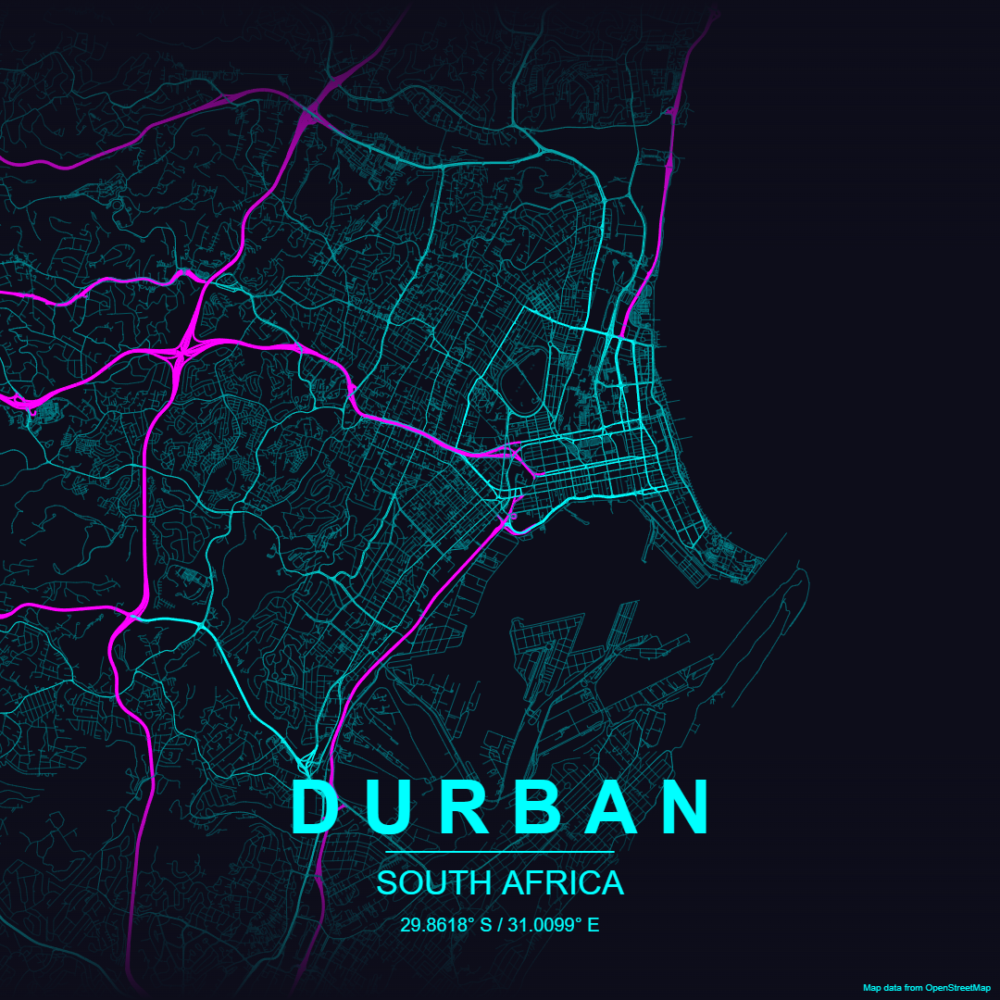
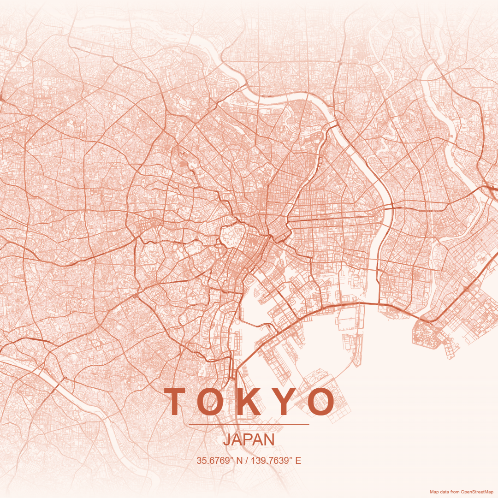
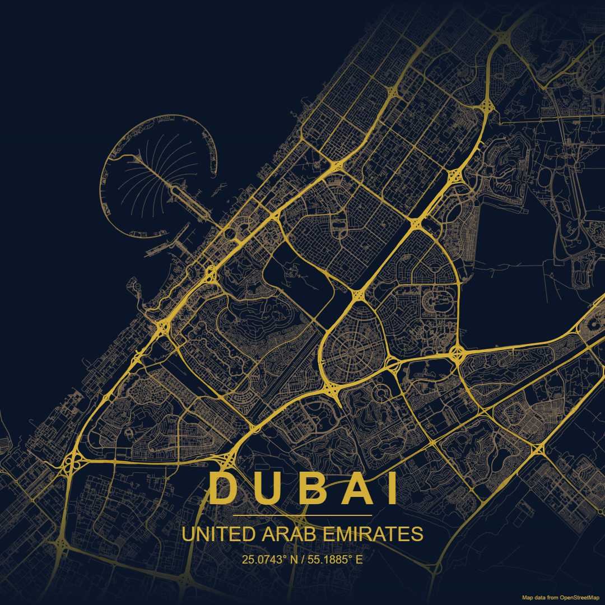

# Map To Poster

Generate beautiful, minimalist map posters for any city in the world right in your browser. No downloads or setup required.

View the live site at <https://malcolm-hall.github.io/map-to-poster>









## Attribution

Inspired by [maptoposter](https://github.com/originalankur/maptoposter) by [originalankur](https://github.com/originalankur). Make sure to check out their project if you like this one.

Geocoding and map data provided by [OpenStreetMap](https://www.openstreetmap.org)

## Data Sources

- [Nominatim](https://nominatim.org) - Geocoding
- [Overpass API](https://overpass-api.de) - OpenStreetMap data

### Caching

All map and location data is cached in the browsers local storage for 12 hours. This enables poster styles to be quickly changed and prevents excessive load on the APIs of the data sources.

## Getting Started

Install the dependencies using Node v24+ or equivalent

```sh
npm install
```

Run the dev server and navigate to <http://localhost:5173/map-to-poster/>

```sh
npm run dev
```

## Deployment

Deployed to [GitHub Pages](https://vite.dev/guide/static-deploy) on push to main
